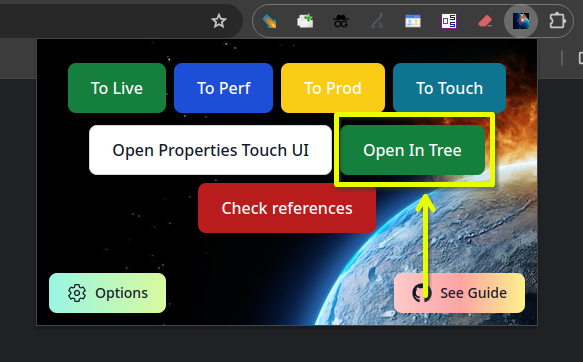

# Quality of Life changes for AEM

This project is designed to automate boring work like copying text or displaying some configuration data on page for you by automating the process.

"Break the AEM" image

## Features

### Jira page
- Automatically creating WF by creating simple button, in Jira ticket page, matching the interface:  

- Auto fix attachment filters
### Almost all AEM and ford.xx pages
- Fast transition between environments, so you can jump from Live directly to Author (you can highlight multiple tabs pressing Shift):  
  
input:
1. https://www.ford.de/fahrzeuge/ford-kuga
2. https://wwwperf-beta-couk.brandeulb.ford.com/cars/focus
3. https://wwwperf.brandeuauthorlb.ford.com/editor.html/content/guxeu/be/fr_be/home/tous-modeles/mustang-mach-e.html
4. https://www.ford.it/content/overlays/wizard-overlays/tdr  
output (clicking to classic, with the shift held down):
1. https://wwwperf.brandeuauthorlb.ford.com/cf#/content/guxeu-beta/de/de_de/home/cars/kuga-dse.html
2. https://wwwperf.brandeuauthorlb.ford.com/cf#/content/guxeu-beta/uk/en_gb/home/cars/new-focus.html
3. https://wwwperf.brandeuauthorlb.ford.com/cf#/content/guxeu/be/fr_be/home/tous-modeles/mustang-mach-e.html
4. https://wwwperf.brandeuauthorlb.ford.com/cf#/content/guxeu-beta/it/it_it/site-wide-content/overlays/wizard-overlays/tdr.html
### Author page
- Open Touch properties in a new tab without page reload needed:  
  
- Open author in AEM tree in a millisecond!!! Opens an already open page, if it exists:  
  
- Showing blocked ticket with link to it's parent ticket:  
  
### Live&Author pages
- Auto-check mothersite links on page (hi Find&Replace);
  
- Get all alt text on a page (appeared at bottom);  
- Highlight heading that support different headings count;  
- Copy all highlighted links (with greater power comes greater responsibility);

Also more small changes such as DL showing in WL and blocking ticket appearing at the top of a page.

AAnd my favorite part - replace boring 404 errors with funny kittens GIFs.

and much more that I forgot.
