# Quality of Life changes for AEM

This project is designed to automate boring work like copying text or displaying some configuration data on page for you by automating the process.

"Break the AEM" image

## Installation
You can just download it throught chrome web store  
https://chromewebstore.google.com/detail/aemfixes/enncmomonbnjkpljcmahbooohommdmnk  
but it always be outdated, so I recommended go throught those steps:  
- First of all you need to download ZIP from GitHub, just hit the buttons that shown in the picture  
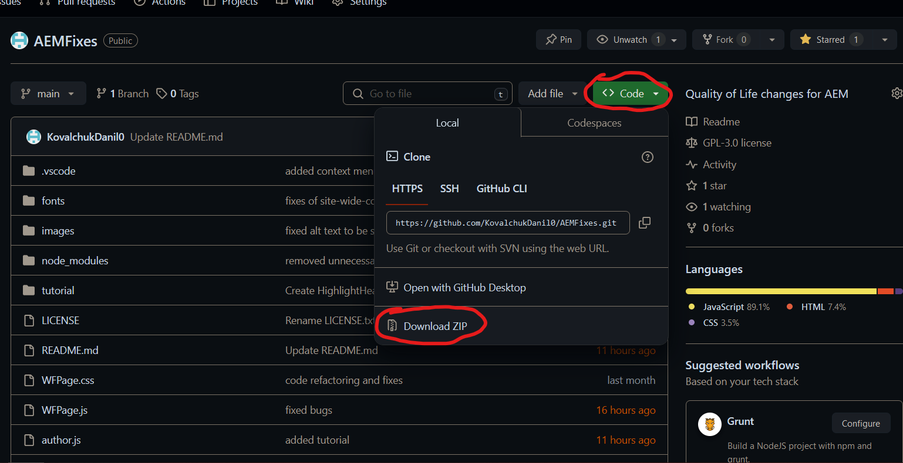  
- Unpack ZIP to any folder (Documents recommended)  
- Then go to the extension dashboard (as marked in red in the picture)  
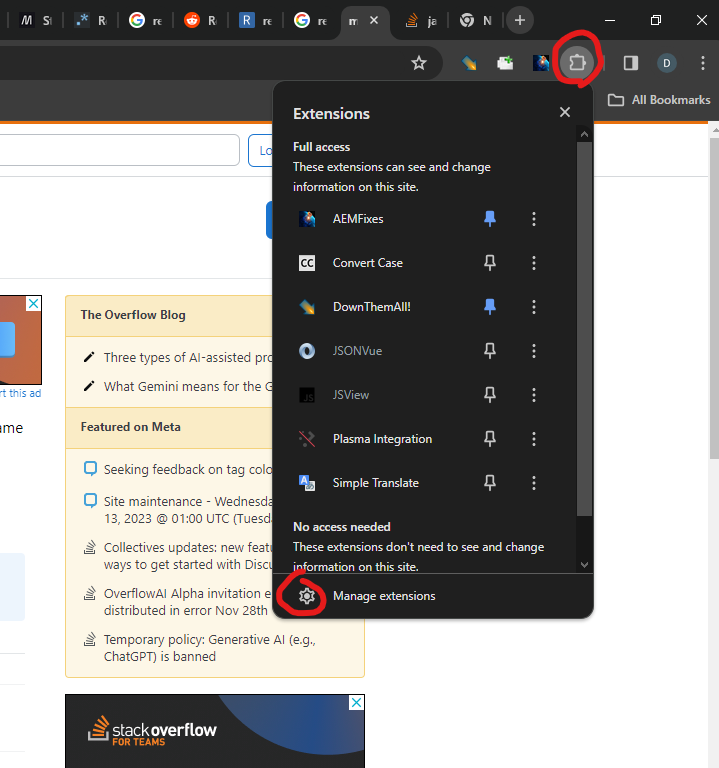  
- And enable developer mode (right top corner), hit load unpacked, and finally load the extension, hitting open folder, that you unpacked (should be node_modules folder in it)  
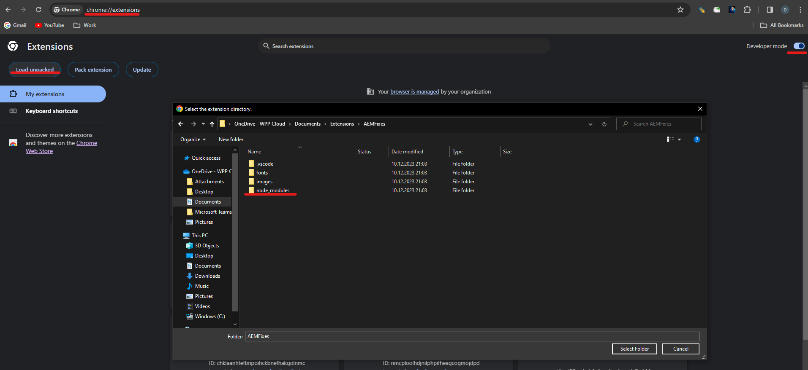  

## Features
***some functions require their parameters to be enabled in options page***  
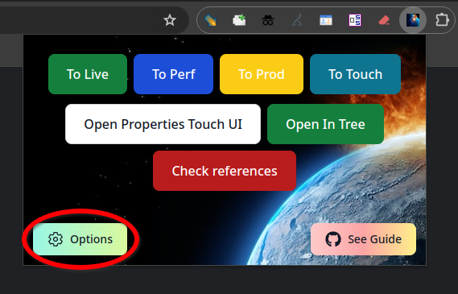  
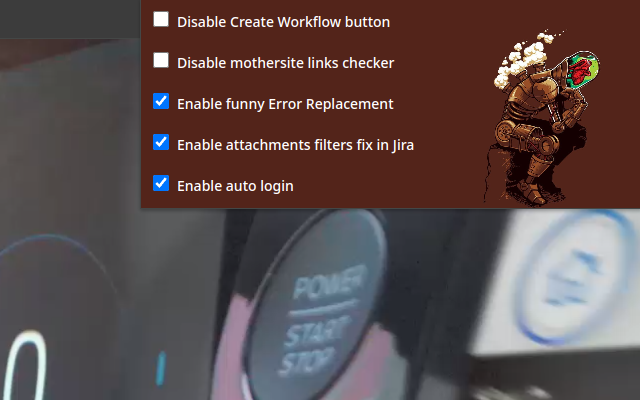  

### Jira page
- Automatically creating WF by adding simple button, in Jira ticket page, matching the interface (can disable):  
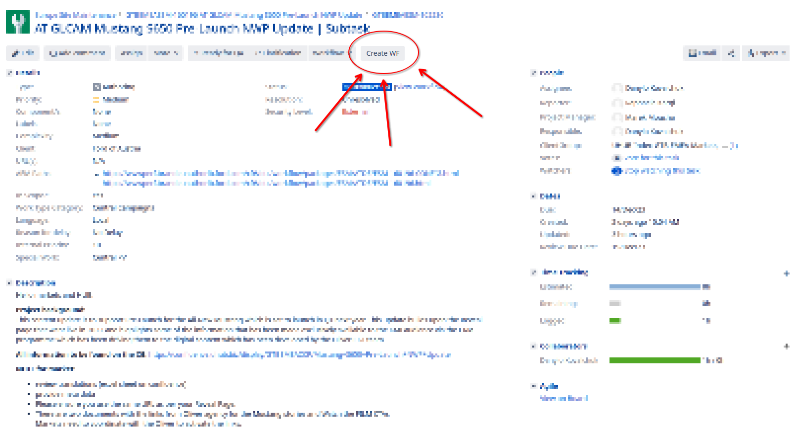  
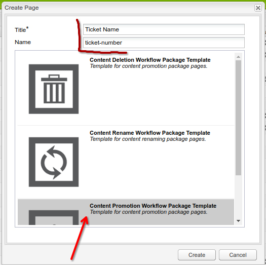  
- Auto fix attachment filters (if option enabled)  
### Almost all AEM and ford.xx pages
- Fast transition between environments, so you can jump from Live directly to Author (you can highlight multiple tabs pressing Shift):  
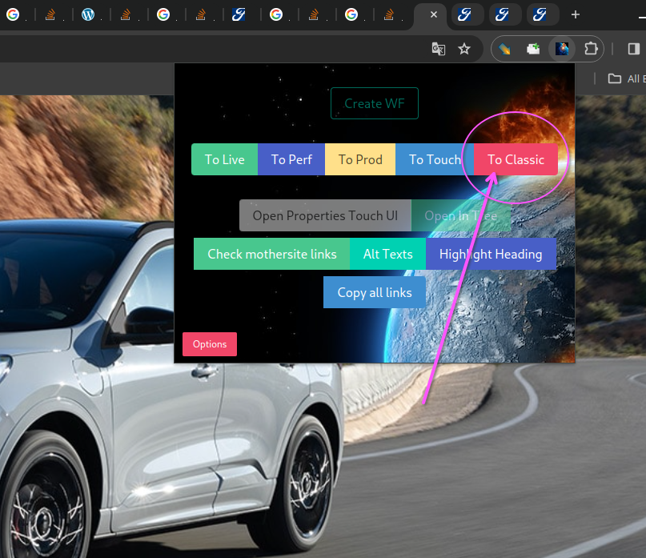  
input:
1. https://www.ford.de/fahrzeuge/ford-kuga
2. https://wwwperf-beta-couk.brandeulb.ford.com/cars/focus
3. https://wwwperf.brandeuauthorlb.ford.com/editor.html/content/guxeu/be/fr_be/home/tous-modeles/mustang-mach-e.html
4. https://www.ford.it/content/overlays/wizard-overlays/tdr  

output (clicking to classic, with the shift held down):

1. https://wwwperf.brandeuauthorlb.ford.com/cf#/content/guxeu-beta/de/de_de/home/cars/kuga-dse.html
2. https://wwwperf.brandeuauthorlb.ford.com/cf#/content/guxeu-beta/uk/en_gb/home/cars/new-focus.html
3. https://wwwperf.brandeuauthorlb.ford.com/cf#/content/guxeu/be/fr_be/home/tous-modeles/mustang-mach-e.html
4. https://wwwperf.brandeuauthorlb.ford.com/cf#/content/guxeu-beta/it/it_it/site-wide-content/overlays/wizard-overlays/tdr.html
- support auto-login (not using personal data)  
### Author page
- Open Touch properties in a new tab without page reload needed:  
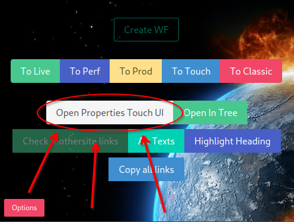  
- Open author in DAM tree in a millisecond!!! Opens an already open page, if it exists:  
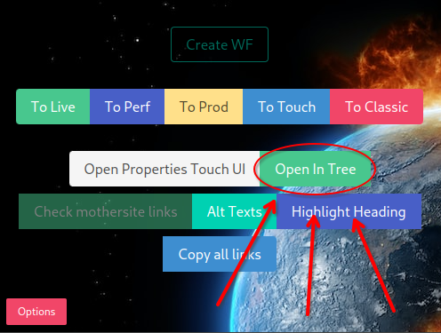  
- Showing blocked ticket with link to it's parent ticket:  
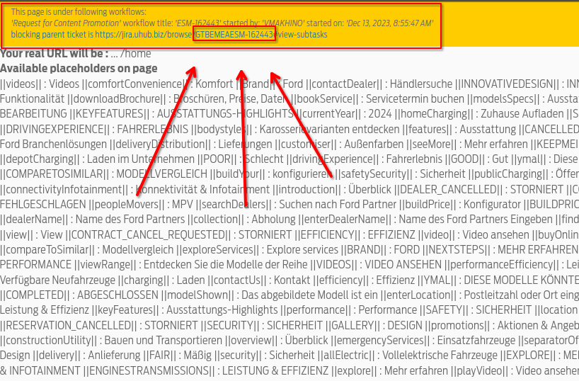
- My favorite part is replacing borring error with kitten gif (if option enabled):  

### Live&Perf pages
- Auto-check mothersite links on page (hi Find&Replace) (can disable);
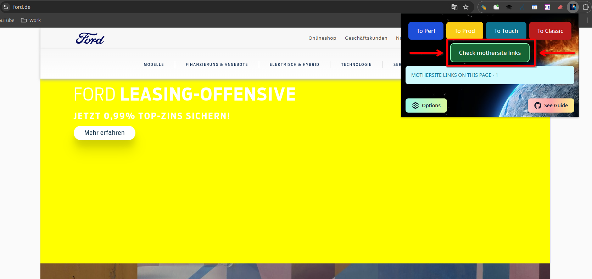
- most useful - car config is showing directly on page (working on all pages dynamically):  
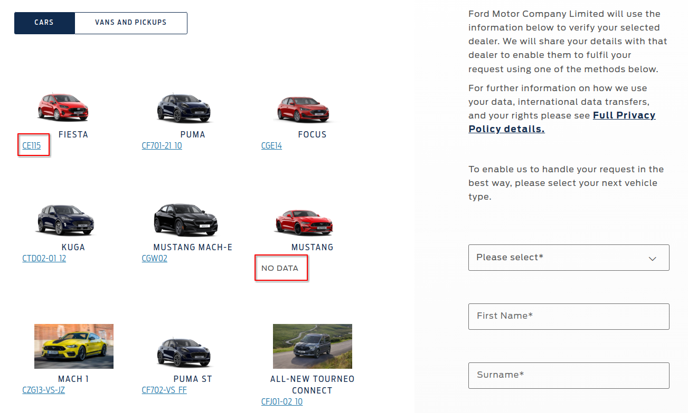  
even working with CV on button hit:  
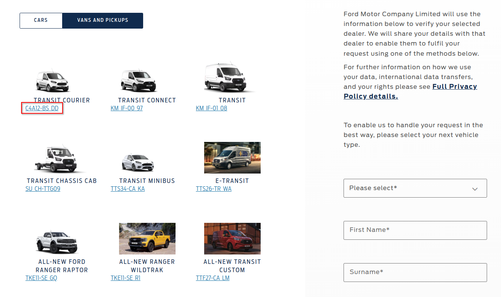
- Random programmer memes if page doesn't exist (if option enabled)  
### Workflow page
- Auto pastle WF title from link  
- Insert some userful links (DL, Market config, etc...) !early beta!  
- Fixing all links in it to be in Touch UI  
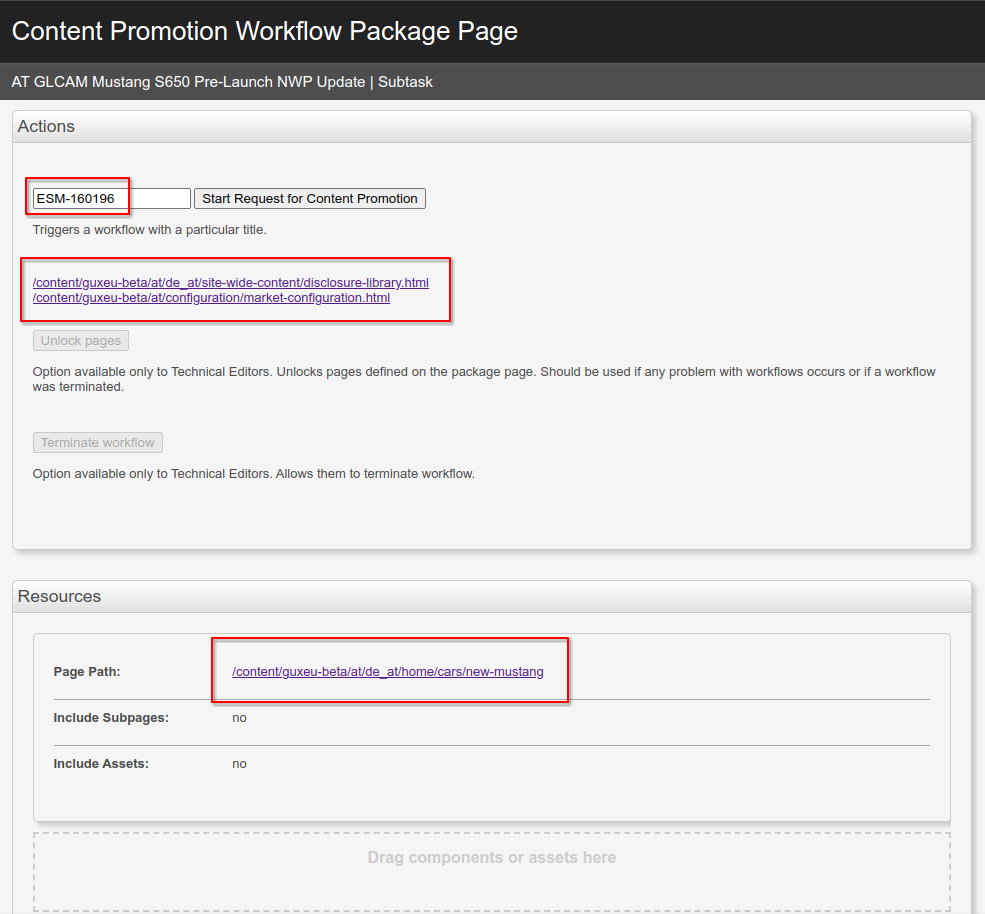  
### DAM Tree
- if you link is MAV opening it in new window in touch UI  
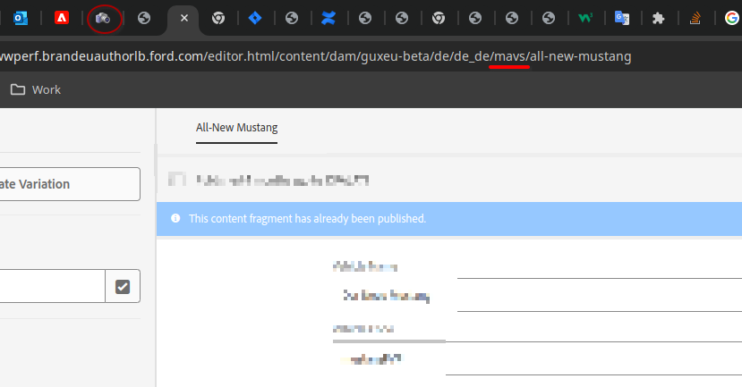
### Context menu
- Open image directly in DAM
- Even faster transition between environments  
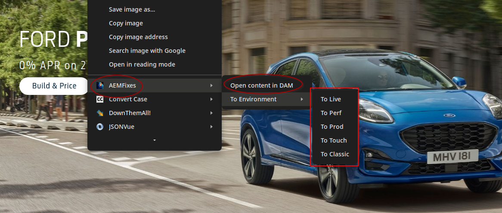  
### All other pages
- Copy all highlighted links (with greater power comes greater responsibility)  
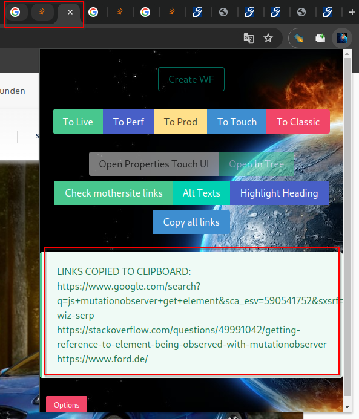  
- Highlight headings  
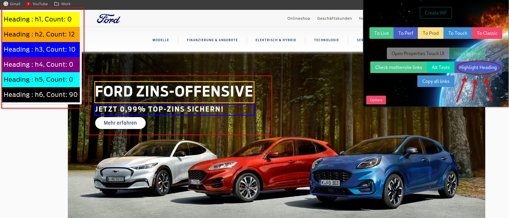  

and much more that I forgot.
